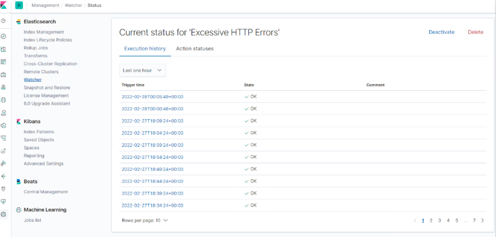

# Blue Team: Summary of Operations

## Table of Contents
- Network Topology
- Description of Targets
- Monitoring the Targets
- Patterns of Traffic & Behavior
- Suggestions for Going Further

### Network Topology

The following machines were identified on the network:
- Kali
  - **Operating System**:
  - **Purpose**: Attacker / Penetration Testing Machine
  - **IP Address**: 192.168.1.100
- ELK
  - **Operating System**: Ubuntu 18.04
  - **Purpose**: Elasticsearch, Logstash, and Kabana
  - **IP Address**: 192.168.1.100
- Capstone 
  - **Operating System**: Ubuntu 18.04
  - **Purpose**: Vulnerable Web Server
  - **IP Address**: 192.168.1.105
- Hyper-V
  - **Operating System**: Windows 
  - **Purpose**: Gateway / Host
  - **IP Address**: 192.168.1.1
- Target 1
  - **Operating System**: Debian GNU/Linux 8
  - **Purpose**: Wordpress host
  - **IP Address**: 192.168.1.1

### Description of Targets

The target of this attack was: `Target 1` (192.168.1.110).

Target 1 is an Apache web server and has SSH enabled, so ports 80 and 22 are possible ports of entry for attackers. As such, the following alerts have been implemented:

### Monitoring the Targets

Traffic to these services should be carefully monitored. To this end, we have implemented the alerts below:

#### Excessive HTTP Errors

Alert 1 is implemented as follows:
  - **Metric**: WHEN count() GROUPED OVER top 5 ‘http.response.status_code’
  - **Threshold**: Above 400
  - **Vulnerability Mitigated**: Enumeration/Brute Force
  - **Reliability**: This alert is high reliability. Measuring by error codes 400 and above will filter out normal or successful responses. High events within the 5 minutes will trigger the alert. 

#### HTTP Request Size Monitor
Alert 2 is implemented as follows:
  - **Metric**: WHEN sum() of http.request.bytes OVER all documents IS ABOVE 3500 FOR THE LAST 1 minute
  - **Threshold**: Above 3500
  - **Vulnerability Mitigated**: Code injection in HTTP requests (XSS and CRLF) or DDOS
  - **Reliability**: Alert could create false positives. It comes in at a medium reliability. There is a possibility for a large non malicious HTTP request or legitimate HTTP traffic.

#### CPU Usage Monitor
Alert 3 is implemented as follows:
  - **Metric**: Open Metricbeats WHEN max() OF system.process.cpu.total.pct OVER all documents IS ABOVE 0.5 FOR THE LAST 5 minutes
  - **Threshold**: Open Metricbeats WHEN max() OF system.process.cpu.total.pct OVER all documents IS ABOVE 0.5 FOR THE LAST 5 minutes
  - **Vulnerability Mitigated**: A successful exploit could allow the attacker to trigger a prolonged status of high CPU utilization relative to the GUI process(es). Upon successful exploitation of this vulnerability, an affected device will still be operative, but its response time and overall performance may be degraded.
  - **Reliability**: The alert is highly reliable. Even if there isn’t a malicious program running this can still help determine where to improve on CPU usage. 

