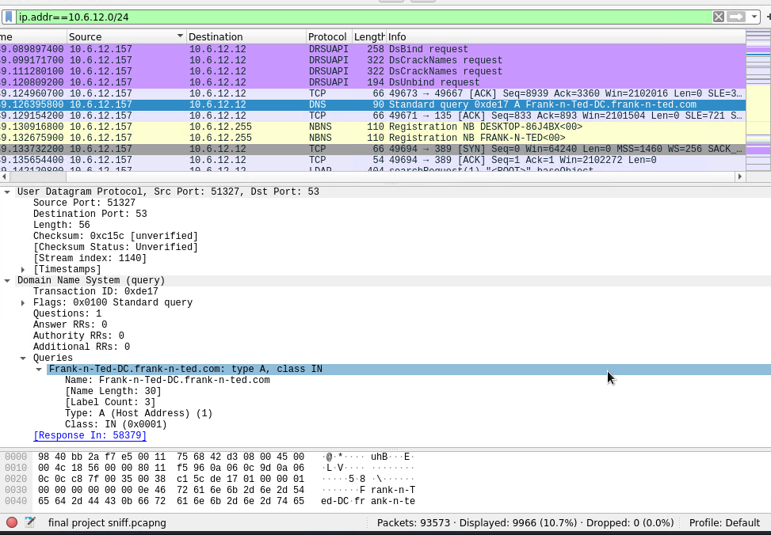
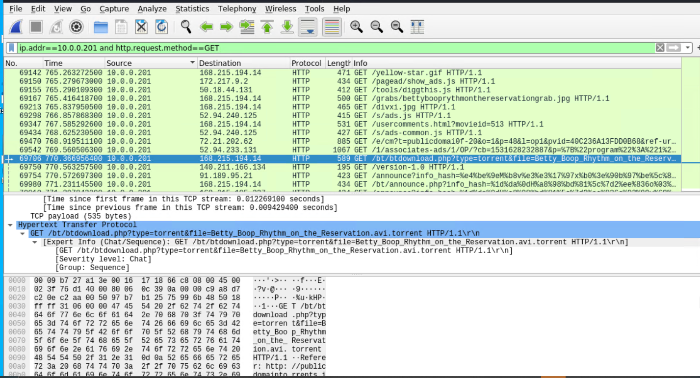

# Network Forensic Analysis Report
## Time Thieves
You must inspect your traffic capture to answer the following questions:
1. What is the domain name of the users' custom site?
   - frank-n-ted.com
2. What is the IP address of the Domain Controller (DC) of the AD network?
   - 10.6.12.12

3. What is the name of the malware downloaded to the 10.6.12.203 machine
   - Once you have found the file, export it to your Kali machine's desktop.
   - June11.dll
4. Upload the file to [VirusTotal.com](https://www.virustotal.com/gui/).

5. What kind of malware is this classified as?
   - Trojan
---
## Vulnerable Windows Machine
1. Find the following information about the infected Windows machine:
    - Host name: ROTTERDAM-PC
    - IP address: 172.16.4.205
    - MAC address: 00:59:07:b0:63:a4
2. What is the username of the Windows user whose computer is infected?
    - matthijs.devries

3. What are the IP addresses used in the actual infection traffic?
    - 172.16.4.205 and 185.243.115.84

---
## Illegal Downloads
1. Find the following information about the machine with IP address `10.0.0.201`:
    - MAC address: 00:16:17:18:66:c8
    - Windows username: elmer.blanco
    - OS version: BLANCO-DESKTOP$

2. Which torrent file did the user download?
    - Betty_Boop_Rhythm_on_the_Reservation.avi.torrent

