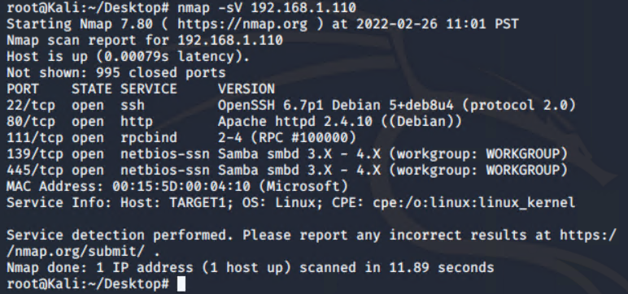

# Red Team: Summary of Operations

## Table of Contents
- Exposed Services
- Critical Vulnerabilities
- Exploitation

### Exposed Services
_TODO: Fill out the information below._

Nmap scan results for each machine reveal the below services and OS details:


```bash
$ nmap ... # TODO: Add command to Scan Target 1
  # TODO: Insert scan output
```

This scan identifies the services below as potential points of entry:
- Target 1
  - List of Exposed Ports
    22/tcp
    80/tcp
    111/tcp
    139/tcp
    145/tcp
  - Exposed Services
    open ssh               OpenSSH 6.7p1 Debian 5+deb8u4
    open http              Apache httpd 2.4.10 ((Debian))
    open prcbind           2-4 (RPC #100000)
    open netbios-ssn       Samba smbd 3.X - 4.X (workgroup: WORKGROUP)
    open netbios-ssn       Samba smbd 3.X - 4.X (workgroup: WORKGROUP)

_TODO: Fill out the list below. Include severity, and CVE numbers, if possible._

The following vulnerabilities were identified on each target:
- Target 1
  - List of
    open port 22 ssh
  - Critical
    high
  - Vulnerabilities
    Week passwords were exploited. Michael's password is michael and Steven's password was easily cracked by John the Ripper. 

_TODO: Include vulnerability scan results to prove the identified vulnerabilities._

### Exploitation
_TODO: Fill out the details below. Include screenshots where possible._

The Red Team was able to penetrate `Target 1` and retrieve the following confidential data:
- Target 1
  - `flag1.txt`: _TODO: Insert `flag1.txt` hash value_
    - **Exploit Used**
      - _TODO: Identify the exploit used_
      - _TODO: Include the command run_
  - `flag2.txt`: _TODO: Insert `flag2.txt` hash value_
    - **Exploit Used**
      - _TODO: Identify the exploit used_
      - _TODO: Include the command run_
