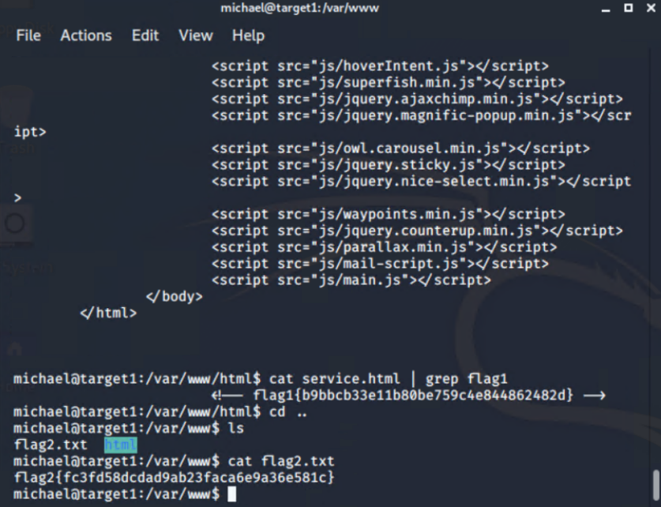

Samba smbd 3.X - 4.X (workgroup: WORKGROUP)# Red Team: Summary of Operations

## Table of Contents
- Exposed Services
- Critical Vulnerabilities
- Exploitation

### Exposed Services
_TODO: Fill out the information below._
  
Nmap scan results for each machine reveal the below services and OS details:

```bash
$ nmap -sV 192.168.1.110
```


This scan identifies the services below as potential points of entry:
- Target 1
  - 22/tcp      open ssh           OpenSSH 6.7p1 Debian 5+deb8u4
  - 80/tcp      open http          Apache httpd 2.4.10 ((Debian))
  - 111/tcp     open prcbind       2-4 (RPC #100000)
  - 139/tcp     open netbios-ssn   Samba smbd 3.X - 4.X (workgroup: WORKGROUP)
  - 145/tcp     open netbios-ssn   Samba smbd 3.X - 4.X (workgroup: WORKGROUP)

The following vulnerabilities were identified on each target:
- Target 1
  - Critical Vulnerability #1 Weak password was exploited, Michael's password is michael
  - Critical Vulnerability #2 Weak password requirements, Steven's password was easily cracked by John the Ripper.
  - Critical Vulnerability #3 MySQL Server login contained the login credentials in wp-config.php in plain text.
  - Critical Vulnerability #4 When logged in as Steven I was able to execute python code to escalate privileges to root.  


### Exploitation

The Red Team was able to penetrate `Target 1` and retrieve the following confidential data:
- Target 1
  - `flag1.txt`: b9bbcb33e11b80be759c4e844862482d


    - **Exploit Used**
      - Veiwed Page Source Code in Browser

  - `flag2.txt`: fc3fd58dcdad9ab23faca6e9a36e581c

    - **Exploit Used**
      - Guessed Michael's password is the same as his username and ssh into the sever
      - ssh michael@192.168.1.110 and used password: michael
