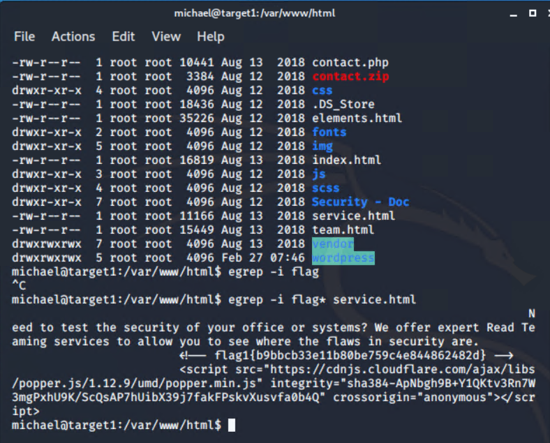

# Red Team: Summary of Operations

## Table of Contents
- Exposed Services
- Critical Vulnerabilities
- Exploitation

### Exposed Services
_TODO: Fill out the information below._
  
Nmap scan results for each machine reveal the below services and OS details:

```bash
$ nmap -sV 192.168.1.110
```


```

This scan identifies the services below as potential points of entry:
- Target 1
  - 22/tcp      open ssh           OpenSSH 6.7p1 Debian 5+deb8u4
  - 80/tcp      open http          Apache httpd 2.4.10 ((Debian))
  - 111/tcp     open prcbind       2-4 (RPC #100000)
  - 139/tcp     open netbios-ssn   Samba smbd 3.X - 4.X (workgroup: WORKGROUP)
  - 145/tcp     open netbios-ssn   Samba smbd 3.X - 4.X (workgroup: WORKGROUP)

The following vulnerabilities were identified on each target:
- Target 1
  - Vulnerability
    open port 22 ssh
  - Criticality 
    high
  - Vulnerabilities
    Week passwords were exploited. Michael's password is michael and Steven's password was easily cracked by John the Ripper.
    Identified users Michael and Steven.
    Michael's password is identical to his user name.
    MySQL Server login contained the login credentials in wp-config.php in plain text.
    When logged in as Steven I was able to execute python code to escalate privileges to root.  

_TODO: Include vulnerability scan results to prove the identified vulnerabilities._

### Exploitation
_TODO: Fill out the details below. Include screenshots where possible._

The Red Team was able to penetrate `Target 1` and retrieve the following confidential data:
- Target 1
  - `flag1.txt`: _TODO: Insert `flag1.txt` hash value_


```bash
    - **Exploit Used**
      - _TODO: Identify the exploit used_
      - _TODO: Include the command run_
  - `flag2.txt`: _TODO: Insert `flag2.txt` hash value_
    - **Exploit Used**
      - _TODO: Identify the exploit used_
      - _TODO: Include the command run_
